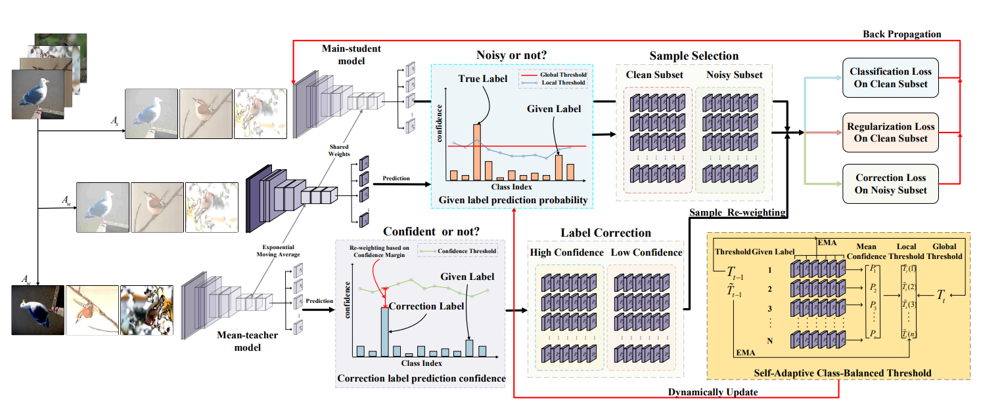

# SACB: Tackling Label Noise in a Self-Adaptive Class-Balanced Manner
**Abstract:** Label noise is inevitable in the real-world dataset, which makes deep neural networks overfit seriously and hurts the model performance dramatically.
The excellent performance of current methods for learning with label noise is based on prior solid knowledge, such as noise rate, artificially preset threshold, and a well-labeled subset. However, this prior solid knowledge is difficult to estimate and obtain in real-world scenarios. Specifically, we design an innovative elf-adaptive Class-balanced sample Selection (SCS) method. Dynamically updated global thresholds and class-based local thresholds of SCS are estimated to divide the clean and noisy subsets based on given labels’ prediction probability and statistical values. Besides, we propose a Self-adaptive Class-balanced sample Re-weighting (SCR) method. A dynamic truncated normal distribution is estimated to assign different weights to different corrected samples based on their confidence to alleviate the deviation of correcting label class distribution. Finally, we employ Consistency Regularization (CR) between the sample’s strong data augmentation predictions and the sample’s weak data augmentation correction labels to mitigate the influence of a few inevitable noisy samples in the clean subset. Extensive experiment results on synthetic and real-world datasets demonstrate our proposed method's effectiveness and superiority, especially when the labeled data are extremely noisy (e.g., Symmetric-80%).

# Pipeline



# Installation
```
pip install -r requirements.txt
```

# Datasets
We conduct noise robustness experiments on two synthetically corrupted datasets (i.e., CIFAR100N and CIFAR80N) and three real-world datasets (i.e., Web-Aircraft, Web-Car and Web-Bird.
Specifically, we create the closed-set noisy dataset CIFAR100N and the open-set noisy dataset CIFAR80N based on CIFAR100.
To make the open-set noisy dataset CIFAR80N, we regard the last 20 categories in CIFAR100 as out-of-distribution. 
We adopt two classic noise structures: symmetric and asymmetric, with a noise ratio $n \in (0,1)$.

You can download the CIFAR10 and CIFAR100 on [this](https://www.cs.toronto.edu/~kriz/cifar.html).

You can download the Clothing1M from [here](https://github.com/NUST-Machine-Intelligence-Laboratory/weblyFG-dataset).

# Training

An example shell script to run SACB on CIFAR-100N :

```python
CUDA_VISIBLE_DEVICES=0 python main.py --warmup-epoch 20 --epoch 100 --batch-size 128 --lr 0.01 --warmup-lr 0.05  --noise-type symmetric --closeset-ratio 0.2 --lr-decay cosine:20,5e-4,100  --opt sgd --dataset cifar100nc  --momentum_scs 0.9 --momentum_scr 0.9 --alpha 1.0 --aph 0.99 
```
An example shell script to run SACB on CIFAR-80N :

```python
CUDA_VISIBLE_DEVICES=0 python main.py --warmup-epoch 20 --epoch 150 --batch-size 128 --lr 0.05 --warmup-lr 0.05  --noise-type symmetric --closeset-ratio 0.2 --lr-decay cosine:20,5e-4,140  --opt sgd --dataset cifar80no  --momentum_scs 0.999 --momentum_scr 0.85 --alpha 0.5 --aph 0.99  
```
Here is an example shell script to run SACB on Web-aircraft :

```python
CUDA_VISIBLE_DEVICES=0 python main_web.py --warmup-epoch 5 --epoch 60 --batch-size 32 --lr 0.00008 --warmup-lr 0.00005  --lr-decay cosine:5,1e-6,55 --weight-decay 5e-4 --seed 2023 --opt adam --dataset web-aircraft --gpu 0 --momentum_scs 0.95 --momentum_scr 0.99 --alpha 1 --aph 0.99
```

# Results on Cifar10 and Cifar100

| Datasets               |  Cifar10               |   Cifar100                | 
|:-----------------------|:-----------------------|:--------------------------|
|  IF                    | [1,10,20,50,100,200]   |    [1,10,20]              |
|  NR                    |  [0.0,0.2,0.4]         |     [0.0,0.2,0.4,0.6]     |
|  CE                    |  74.49                 | 46.76                     |
|  Class-Balanced        |63.49                   |     42.81                 |
|  Focal                 |71.59                   |         43.85             |
|  LDAM-DRW              |  73.46                 |         45.47             |
|Co-teaching             |  60.63                 |         36.55             |
|O2U                     |  65.01                 |         40.21             |
|MW-Net                  |  74.13                 |         49.28             |
|HAR                     | 73.50                  |          42.88            |
|CurveNet                |  75.70                 | 50.49                     |
|Ours                    |78.47                   |     52.94                 |

